# NeoxAgent — Diagramas UML

> Documentación UML completa de la arquitectura del NeoxAgent.
> Todos los diagramas están en formato [Mermaid](https://mermaid.js.org/) para renderizado directo en GitHub/GitLab/VS Code.
>
> Generado: 2026-02-18

---

## Tabla de Contenidos

1. [Diagrama de Componentes — Arquitectura General](#1-diagrama-de-componentes--arquitectura-general)
2. [Diagrama de Clases — Modelo de Datos](#2-diagrama-de-clases--modelo-de-datos)
3. [Diagrama de Clases — Configuración](#3-diagrama-de-clases--configuración)
4. [Diagrama de Clases — Sistema de Errores](#4-diagrama-de-clases--sistema-de-errores)
5. [Diagrama de Paquetes — Módulos del Sistema](#5-diagrama-de-paquetes--módulos-del-sistema)
6. [Diagrama de Secuencia — Autenticación API Key](#6-diagrama-de-secuencia--autenticación-api-key)
7. [Diagrama de Secuencia — Ciclo de Vida de un Contenedor](#7-diagrama-de-secuencia--ciclo-de-vida-de-un-contenedor)
8. [Diagrama de Secuencia — Creación de Pod con Tun2socks](#8-diagrama-de-secuencia--creación-de-pod-con-tun2socks)
9. [Diagrama de Secuencia — WebSocket Console](#9-diagrama-de-secuencia--websocket-console)
10. [Diagrama de Secuencia — Deploy Kubernetes YAML](#10-diagrama-de-secuencia--deploy-kubernetes-yaml)
11. [Diagrama de Secuencia — Gestión de Archivos (File Manager)](#11-diagrama-de-secuencia--gestión-de-archivos)
12. [Diagrama de Actividad — Flujo de Backup](#12-diagrama-de-actividad--flujo-de-backup)
13. [Diagrama de Actividad — Restauración de Backup](#13-diagrama-de-actividad--restauración-de-backup)
14. [Diagrama de Secuencia — Pull de Imágenes (WebSocket)](#14-diagrama-de-secuencia--pull-de-imágenes-websocket)
15. [Diagrama de Secuencia — Systemd Integration](#15-diagrama-de-secuencia--systemd-integration)
16. [Diagrama de Actividad — Seguridad Path Traversal](#16-diagrama-de-actividad--seguridad-path-traversal)
17. [Diagrama de Estado — Ciclo de Vida del Pod](#17-diagrama-de-estado--ciclo-de-vida-del-pod)

---

## 1. Diagrama de Componentes — Arquitectura General

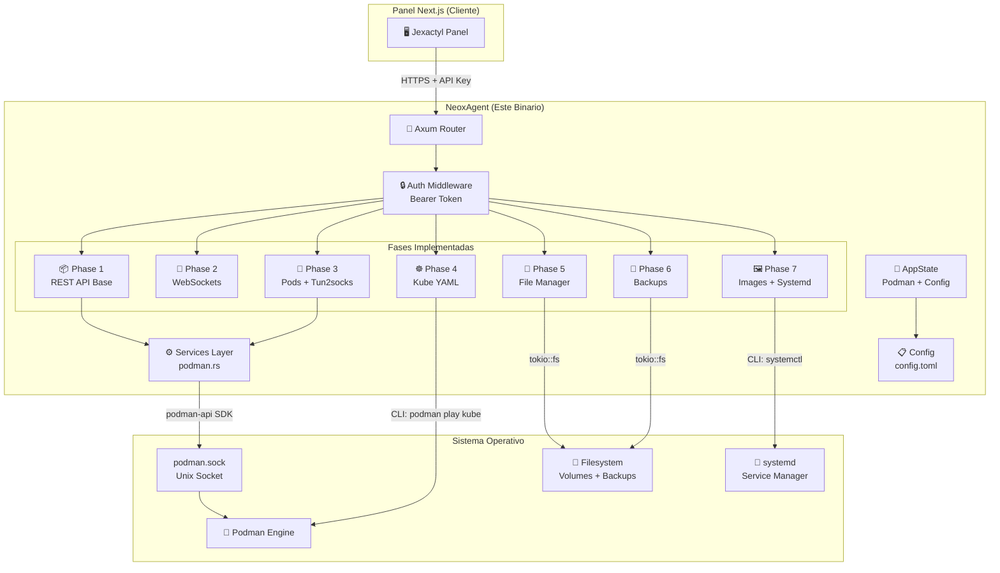

---

## 2. Diagrama de Clases — Modelo de Datos

```mermaid
classDiagram
    direction TB
    
    class AppState {
        +Podman podman
        +Config config
    }

    %% ═══ Container Models ═══
    class CreateContainerRequest {
        +String name
        +String image
        +HashMap~String,String~ env
        +Vec~PortMapping~ ports
        +Vec~VolumeMount~ volumes
        +ResourceLimits limits
        +HashMap~String,String~ labels
        +Vec~String~ dns
        +Vec~String~ command
        +String restart_policy
    }

    class ContainerResponse {
        +String id
        +String name
        +String image
        +String status
        +String created
        +HashMap~String,String~ labels
        +Vec~PortMapping~ ports
        +Vec~MountInfo~ mounts
        +ResourceUsage resources
    }

    class PortMapping {
        +u16 host_port
        +u16 container_port
        +String protocol
        +String host_ip
    }

    class VolumeMount {
        +String host_path
        +String container_path
        +bool read_only
    }

    class ResourceLimits {
        +i64 memory_mb
        +f64 cpu_cores
    }

    %% ═══ Pod Models ═══
    class CreatePodRequest {
        +String name
        +ProxyConfig proxy
        +Vec~PodContainerSpec~ containers
        +HashMap~String,String~ labels
        +Vec~String~ dns_servers
        +String hostname
        +String network
    }

    class ProxyConfig {
        +bool enabled
        +String proxy_type
        +String image
        +String socks5_url
        +String dns
        +HashMap~String,String~ env
        +String loglevel
    }

    class PodContainerSpec {
        +String name
        +String image
        +HashMap~String,String~ env
        +Vec~PortMapping~ ports
        +ResourceLimits limits
        +Vec~VolumeMount~ volumes
        +HashMap~String,String~ labels
        +String restart_policy
        +Vec~String~ command
    }

    class PodResponse {
        +String id
        +String name
        +String status
        +String created_at
        +String hostname
        +HashMap~String,String~ labels
        +Vec~PodContainerInfo~ containers
        +bool proxy_enabled
        +String infra_id
    }

    %% ═══ Network Models ═══
    class CreateNetworkRequest {
        +String name
        +String driver
        +bool dns_enabled
        +bool internal
        +bool ipv6_enabled
        +String subnet
        +String gateway
        +HashMap~String,String~ labels
    }

    class NetworkResponse {
        +String name
        +String id
        +String driver
        +bool dns_enabled
        +bool internal
        +Vec~SubnetInfo~ subnets
        +HashMap~String,String~ labels
    }

    %% ═══ File Manager Models ═══
    class FileEntry {
        +String name
        +String entry_type
        +u64 size
        +String modified
        +String permissions
        +u64 children
    }

    class RenameRequest {
        +String from
        +String to
    }

    %% ═══ Backup Models ═══
    class BackupInfo {
        +String id
        +String pod_id
        +u64 size_bytes
        +f64 size_mb
        +String created_at
        +String checksum_sha256
        +bool server_was_stopped
        +String filename
        +String description
    }

    class CreateBackupRequest {
        +bool stop_server
        +String description
    }

    %% ═══ Image Models ═══
    class ImageInfo {
        +String id
        +Vec~String~ repo_tags
        +Vec~String~ repo_digests
        +i64 size
        +i64 virtual_size
        +i64 created
    }

    class PullImageRequest {
        +String image
    }

    class ImageSearchQuery {
        +String q
        +u32 limit
    }

    %% ═══ Systemd Models ═══
    class SystemdGenerateResponse {
        +String pod_id
        +String service_name
        +String service_file_path
        +String unit_content
    }

    class SystemdStatusResponse {
        +String pod_id
        +String service_name
        +String active_state
        +String sub_state
        +bool enabled
    }

    %% ═══ Relationships ═══
    CreateContainerRequest --> PortMapping
    CreateContainerRequest --> VolumeMount
    CreateContainerRequest --> ResourceLimits
    CreatePodRequest --> ProxyConfig
    CreatePodRequest --> PodContainerSpec
    PodContainerSpec --> PortMapping
    PodContainerSpec --> VolumeMount
    PodContainerSpec --> ResourceLimits
    ContainerResponse --> PortMapping
```

---

## 3. Diagrama de Clases — Configuración

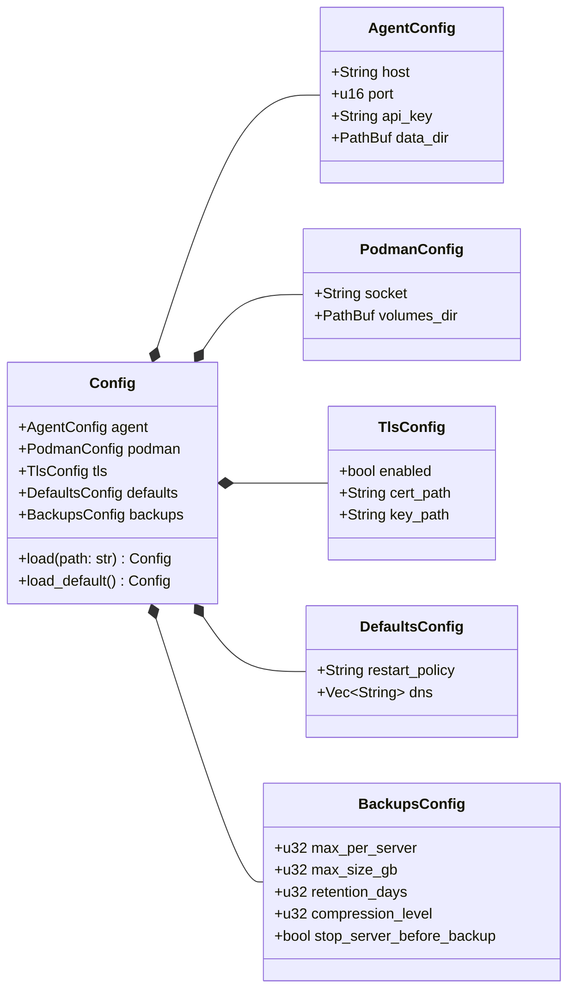

---

## 4. Diagrama de Clases — Sistema de Errores

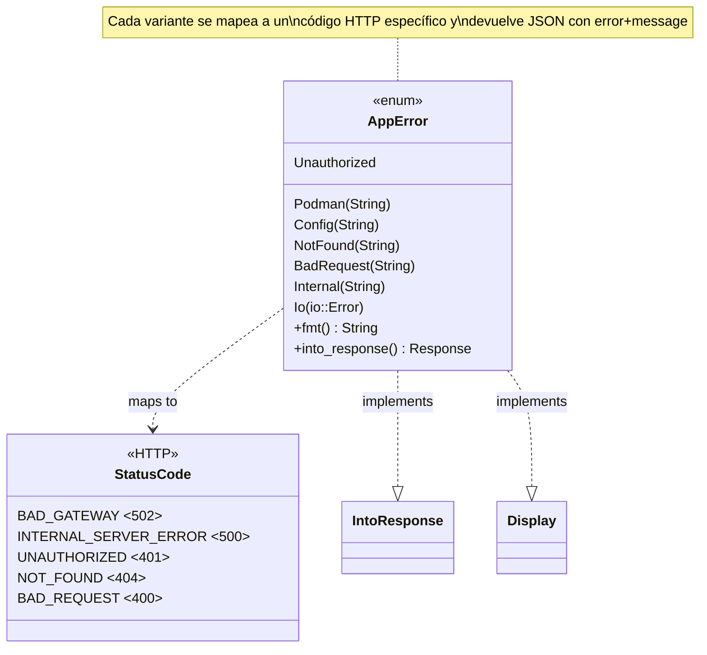

---

## 5. Diagrama de Paquetes — Módulos del Sistema

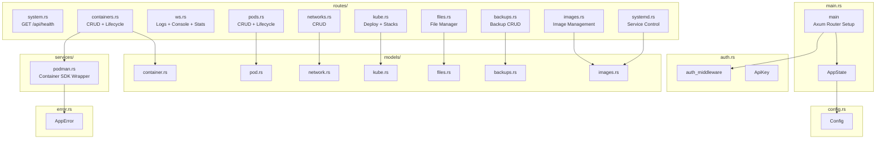

---

## 6. Diagrama de Secuencia — Autenticación API Key

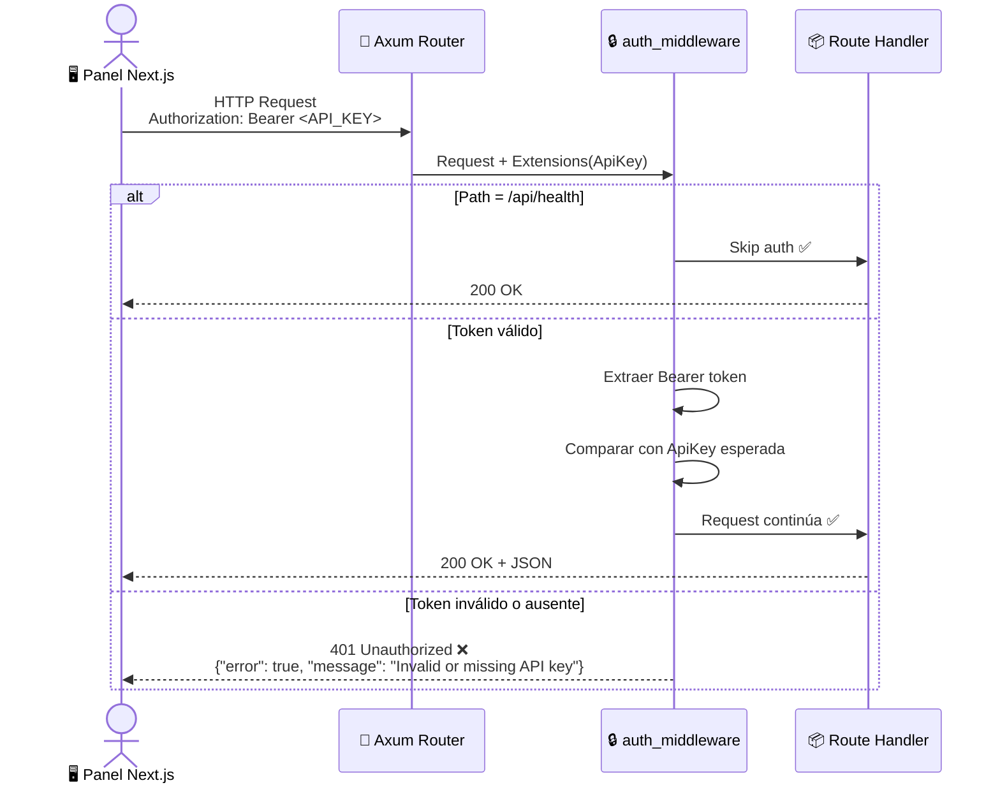

---

## 7. Diagrama de Secuencia — Ciclo de Vida de un Contenedor

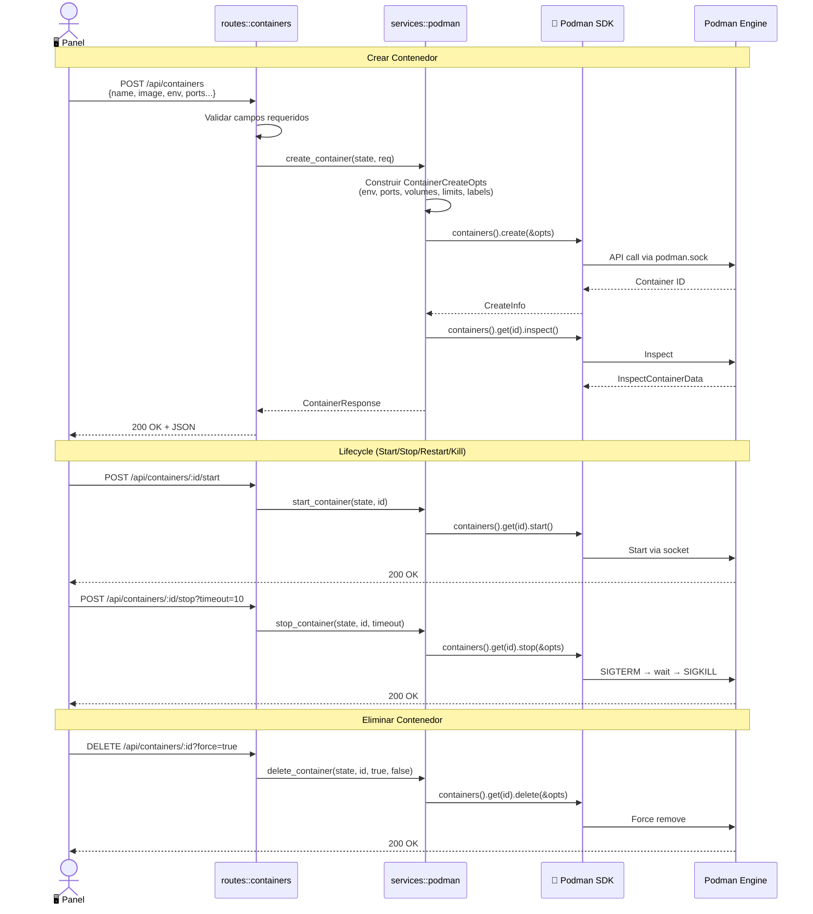

---

## 8. Diagrama de Secuencia — Creación de Pod con Tun2socks

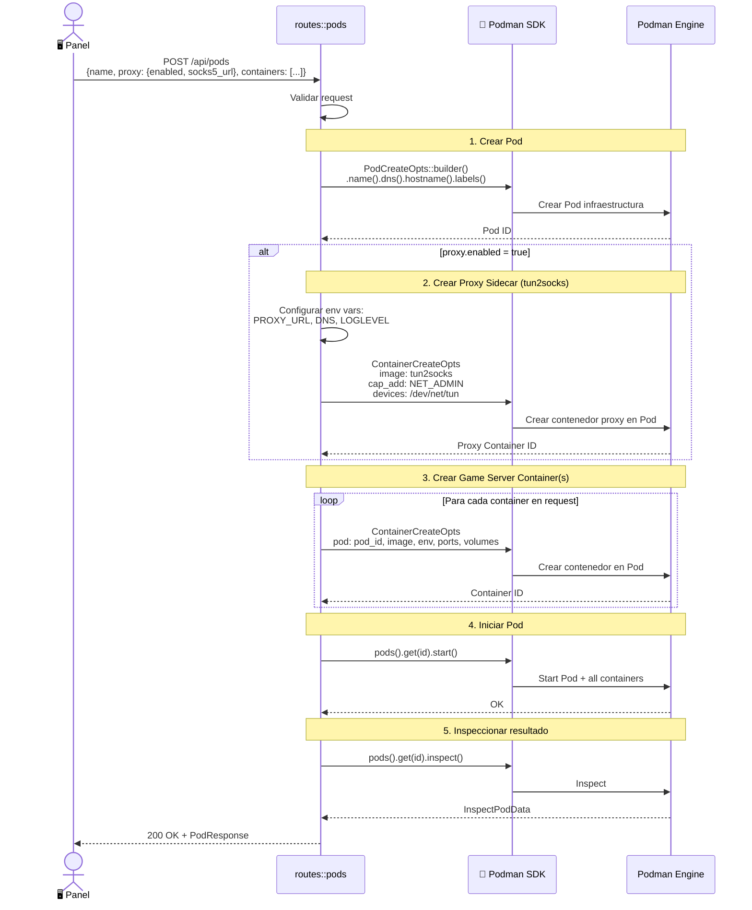

---

## 9. Diagrama de Secuencia — WebSocket Console

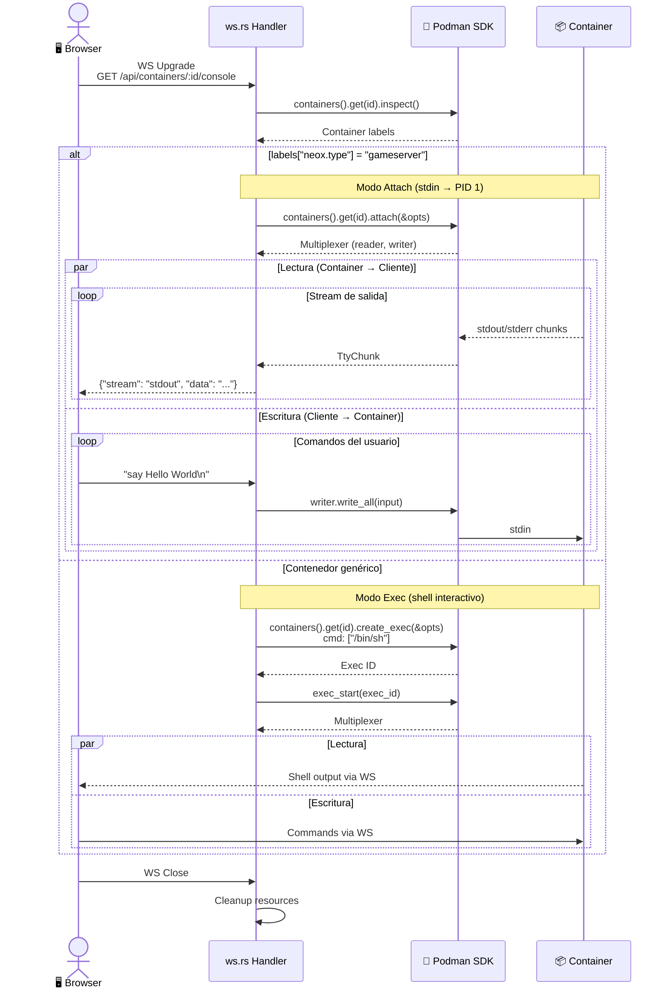

---

## 10. Diagrama de Secuencia — Deploy Kubernetes YAML

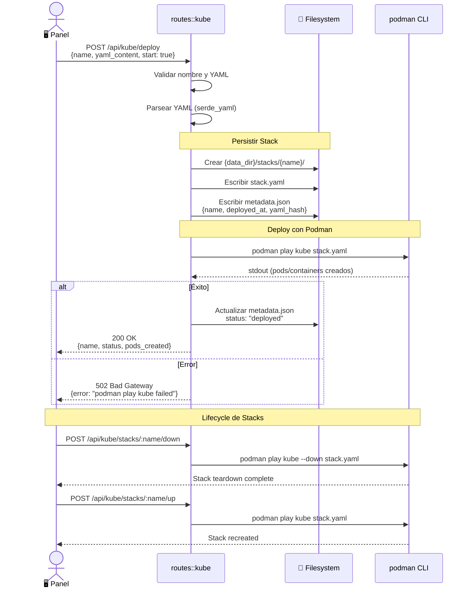

---

## 11. Diagrama de Secuencia — Gestión de Archivos

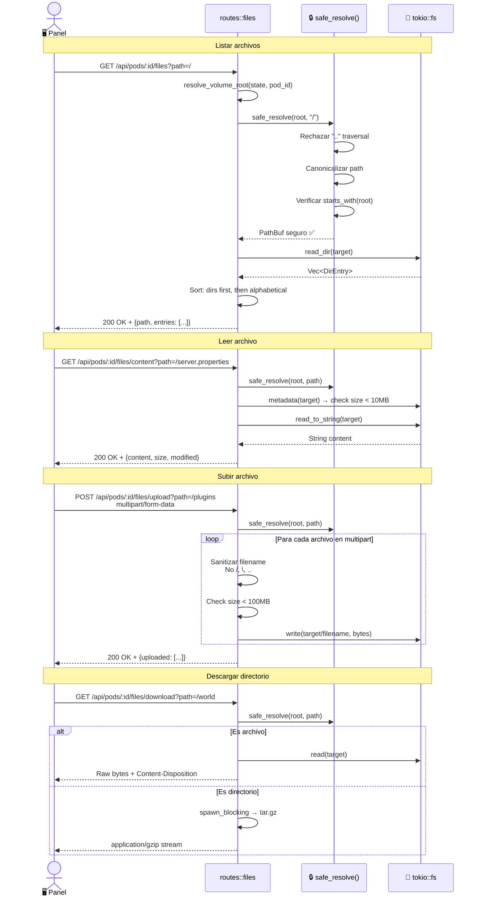

---

## 12. Diagrama de Actividad — Flujo de Backup

```mermaid
flowchart TD
    A[📥 POST /api/pods/:id/backups] --> B{Volume dir<br/>existe?}
    B -->|No| ERR1[❌ 404 Not Found]
    B -->|Sí| C[Crear backups/ dir]
    C --> D{stop_server?}
    
    D -->|Sí| E[⏹️ podman pod stop]
    E --> F[Crear tar.gz]
    D -->|No| F
    
    F --> G[📦 spawn_blocking<br/>tar::Builder + flate2::GzEncoder]
    G --> H[Comprimir volumes_dir/{pod_id}/<br/>→ YYYYMMDD_HHMMSS.tar.gz]
    
    H --> I[🔐 spawn_blocking<br/>SHA256 checksum]
    I --> J[📝 Crear BackupInfo<br/>id, size, checksum, timestamp]
    
    J --> K[Actualizar index.json]
    K --> L{Supera<br/>max_per_server?}
    
    L -->|Sí| M[🗑️ Eliminar backups más antiguos]
    M --> N{Se detuvo<br/>el server?}
    L -->|No| N
    
    N -->|Sí| O[▶️ podman pod start]
    O --> P[✅ 200 OK + BackupInfo]
    N -->|No| P

    style A fill:#4CAF50,color:#fff
    style ERR1 fill:#f44336,color:#fff
    style P fill:#2196F3,color:#fff
    style G fill:#FF9800,color:#fff
    style I fill:#FF9800,color:#fff
```

---

## 13. Diagrama de Actividad — Restauración de Backup

```mermaid
flowchart TD
    A[📥 POST /api/pods/:id/backups/:backup_id/restore] --> B{Backup existe<br/>en index.json?}
    B -->|No| ERR1[❌ 404 Not Found]
    B -->|Sí| C{Archivo .tar.gz<br/>existe en disco?}
    C -->|No| ERR2[❌ 404 File Not Found]
    C -->|Sí| D[⏹️ podman pod stop]
    
    D --> E[🗑️ Limpiar volume dir<br/>remove_dir_all + remove_file<br/>Mantener dir raíz]
    
    E --> F[📦 spawn_blocking<br/>Extraer tar.gz]
    F --> G[flate2::GzDecoder<br/>tar::Archive::entries]
    G --> H[Strip "data/" prefix<br/>Recrear estructura de archivos]
    
    H --> I[▶️ podman pod start]
    I --> J{Pod inició<br/>correctamente?}
    
    J -->|Sí| K[✅ 200 OK<br/>pod_restarted: true]
    J -->|No| L[⚠️ 200 OK<br/>pod_restarted: false]

    style A fill:#4CAF50,color:#fff
    style ERR1 fill:#f44336,color:#fff
    style ERR2 fill:#f44336,color:#fff
    style K fill:#2196F3,color:#fff
    style L fill:#FF9800,color:#fff
```

---

## 14. Diagrama de Secuencia — Pull de Imágenes (WebSocket)

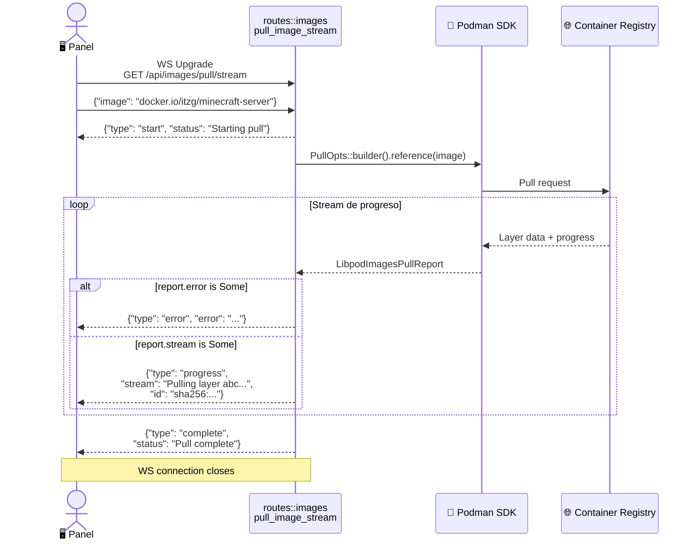

---

## 15. Diagrama de Secuencia — Systemd Integration

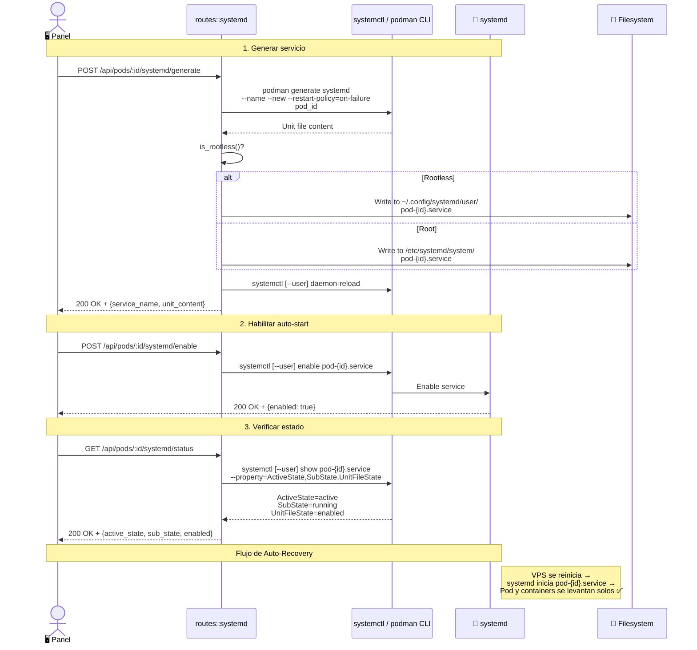

---

## 16. Diagrama de Actividad — Seguridad Path Traversal

```mermaid
flowchart TD
    A[🔍 safe_resolve<br/>volume_root, user_path] --> B{Contiene<br/>"../" ?}
    B -->|Sí| DENY1[❌ 403 Access Denied<br/>Path traversal detected]
    B -->|No| C[Construir path:<br/>volume_root.join user_path]
    
    C --> D{volume_root<br/>existe?}
    D -->|No| E[Crear volume_root<br/>create_dir_all]
    D -->|Sí| F[Canonicalizar<br/>volume_root]
    E --> F
    
    F --> G{Target existe?}
    G -->|Sí| H[Canonicalizar target]
    G -->|No| I[Canonicalizar parent dir]
    
    H --> J{canonical_target<br/>starts_with<br/>canonical_root?}
    I --> J
    
    J -->|No| DENY2[❌ 403 Access Denied<br/>Path outside volume]
    J -->|Sí| K[✅ Return PathBuf seguro]

    style DENY1 fill:#f44336,color:#fff
    style DENY2 fill:#f44336,color:#fff
    style K fill:#4CAF50,color:#fff
```

---

## 17. Diagrama de Estado — Ciclo de Vida del Pod

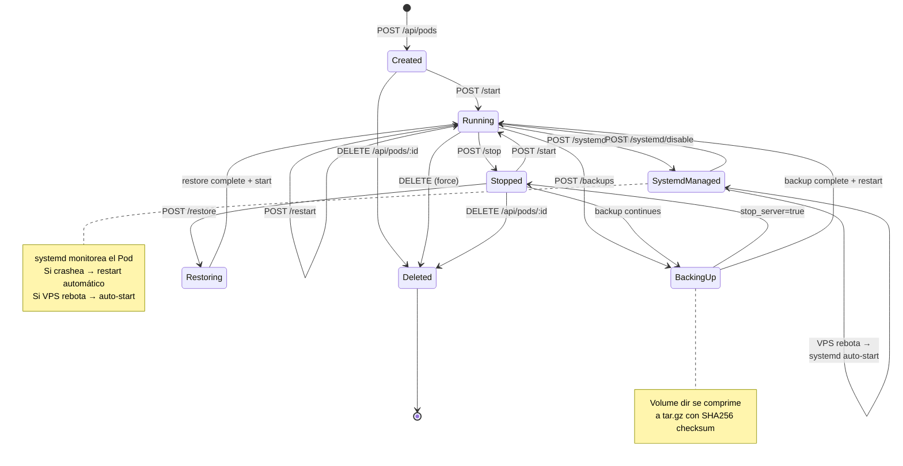

---

## Resumen de Endpoints por Fase

| Fase | Módulo | Endpoints | Descripción |
|:-----|:-------|:---------:|:------------|
| **1** | `containers.rs` | 7 | CRUD + Lifecycle (start/stop/restart/kill) |
| **1** | `system.rs` | 1 | Health check |
| **2** | `ws.rs` | 3 | WebSocket: logs, console, stats |
| **3** | `pods.rs` | 9 | Pod CRUD + Lifecycle + Tun2socks |
| **3** | `networks.rs` | 4 | Network CRUD |
| **4** | `kube.rs` | 7 | Deploy YAML + Stack management |
| **5** | `files.rs` | 8 | File Manager (list, read, write, upload, download...) |
| **6** | `backups.rs` | 6 | Backup CRUD + Restore |
| **7** | `images.rs` | 5 | Image management + WS Pull Stream |
| **7** | `systemd.rs` | 4 | Systemd generate/enable/disable/status |
| | | **54** | **Total endpoints** |
